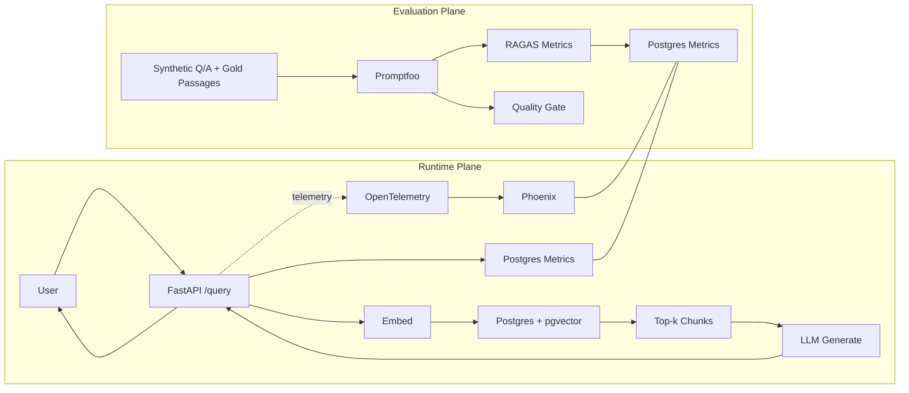

# Architecture Diagram

```mermaid
flowchart LR
  subgraph Runtime_Plane[Runtime Plane]
    U[User] --> API[FastAPI /query]
    API --> EMB[Embed]
    EMB --> VS[Postgres + pgvector]
    VS --> RET[Top-k Chunks]
    RET --> GEN[LLM Generate]
    GEN --> API
    API --> U

    API -. telemetry .-> OTEL[OpenTelemetry]
    OTEL --> PHX[Phoenix]
    API --> METR[Postgres Metrics]
  end

  subgraph Eval_Plane[Evaluation Plane]
    DS[Synthetic Q/A + Gold Passages] --> PF[Promptfoo]
    PF --> RAGAS[RAGAS Metrics]
    RAGAS --> EVALDB[Postgres Metrics]
    PF --> GATE[Quality Gate]
  end

  PHX --- EVALDB
  METR --- EVALDB
```
