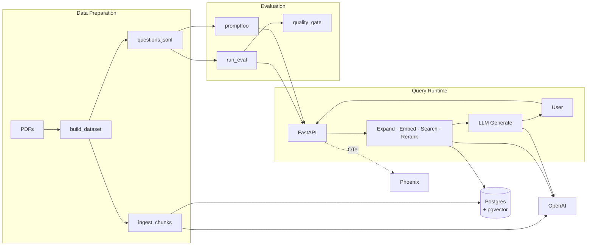

# Architecture Diagram

```mermaid
flowchart LR
  subgraph Data[Data Preparation]
    PDF[PDFs] --> BUILD[build_dataset] --> INGEST[ingest_chunks]
    BUILD --> QS[questions.jsonl]
  end

  subgraph Runtime[Query Runtime]
    U[User] --> API[FastAPI]
    API --> RETRIEVE[Expand · Embed · Search · Rerank]
    RETRIEVE --> GEN[LLM Generate]
    GEN --> U
  end

  subgraph Eval[Evaluation]
    QS --> EVAL[run_eval]
    QS --> PF[promptfoo]
    EVAL --> GATE[quality_gate]
  end

  INGEST & RETRIEVE & GEN --> OAI[OpenAI]
  INGEST & RETRIEVE --> PG[(Postgres\n+ pgvector)]
  API -. OTel .-> PHX[Phoenix]
  EVAL & PF --> API
```
