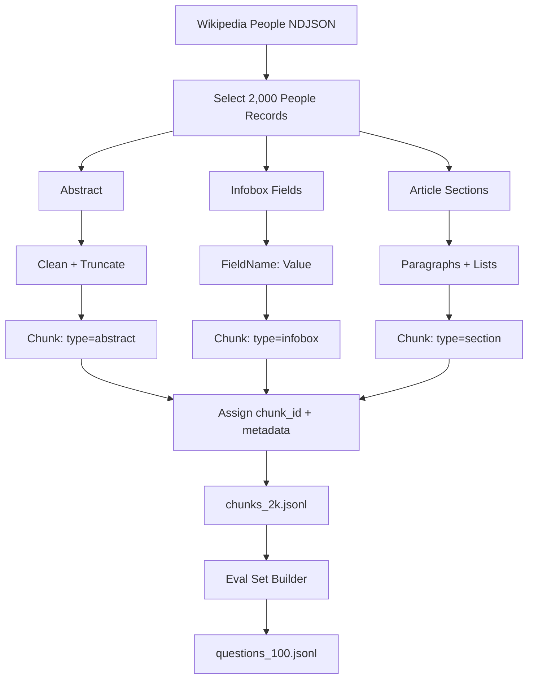

# Chunking Process Diagram

```mermaid
flowchart TD
  A[Wikipedia People NDJSON] --> B[Select 2,000 People Records]

  B --> C1[Abstract]
  B --> C2[Infobox Fields]
  B --> C3[Article Sections]

  C1 --> D1[Clean + Truncate]
  C2 --> D2[FieldName: Value]
  C3 --> D3[Paragraphs + Lists]

  D1 --> E1[Chunk: type=abstract]
  D2 --> E2[Chunk: type=infobox]
  D3 --> E3[Chunk: type=section]

  E1 --> F[Assign chunk_id + metadata]
  E2 --> F
  E3 --> F

  F --> G[chunks_2k.jsonl]

  G --> H[Eval Set Builder]
  H --> I[questions_100.jsonl]
```
